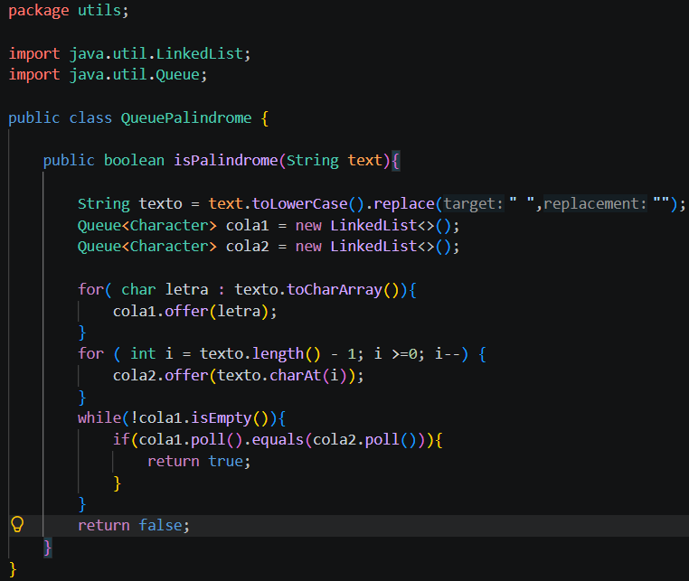
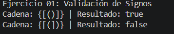
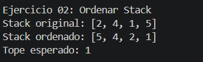
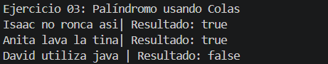
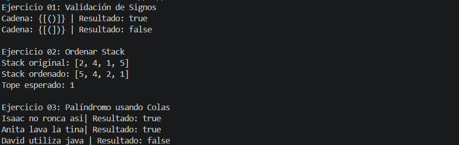

            
## **PRÁCTICA 3:** Ejercicios de logica con estructuras lineales: pilas y colas

- **Nombres**: Edwin Pintado , Kevin Sacaquirin , Galo Prieto.

- **Fecha de entrega**: 13 de junio del 2026

## **Descripcion del proyecto:**

Desarrollo de tres ejercicios enfocados en el uso de estructuras lineales como pilas(Stack) y colas(Queue) , con el objetio de mejorar la lógica de programación de los estudiantes, mediante la resolución de problemas.  

## **Ejercicio 01:** Validacion de signos.

El primer ejercicio se basa en crear un algoritmo que detecte si un arreglo (pila) de strings, que contiene los siguientes símbolos () [] {} cierren correctamente, este método permite verificar si los simbolos cierran en el orden correcto, es decir, que cada símbolo de apertura cierre sin obstaculos con su símbolo de cierre, devolviendo un valor booleano (true o false), dependiendo del resultado.  

## **Ejercicio 02:** Ordenar un Stack.

Es un método que sirve para ordenar un stack de números enteros, ordenandolos de tal manera que el dato más pequeño quede en el tope, para esto se utiliza un stack auxiliar con el objetivo de almacenar los datos temporalmente, evitando así que estos valores se pierdan al momento de extraerlos del stack para compararlos y ordenarlos debidamente. 

## **Ejercicio 03:** Determinar si una palabra o frase es palíndroma usando colas.

La funcionalidad de este algoritmo se basa en verificar si una palabra es un palíndromo, es decir,no importa desde que lado lo leas siempre dirá lo mismo, este método devuelve un valor booleano (true o false) dependiendo si es o no palíndromo.

Se usaran dos métodos que transformen el texto, para realizar la comparación. 

- toLowerCase(): Transforma cada letra en minuscula. 
- replace(" ",""): Esto cambiara los espacios del texto por un valor vacío, es decir, "elimina" los espacios.
- Se utilizaron dos colas internamente para que la comprobación de cada letra sea más sencilla.

## **Captura o bloque de codigo de cada ejercicio:**

## **Ejercicio 01:**

## **Ejercicio 02:**

## **Ejercicio 03:**

## **Captura o bloque de consola de cada ejercicio:**

## **Ejercicio 01:**

## **Ejercicio 02:**

## **Ejercicio 03:** 

## **RESULTADOS OBTENIDOS:** 

**Tabla de evidencias requeridas.**

| Ejercicio | Evidencia de código | Evidencia de consola | Observación |
| :--- | :--- | :--- | :--- |
| Ejercicio 01: Validación de signos ||| El método se implemento correctamente y su salida fue la esperada, para esto transformamos el String en un arreglo, se verifica símbolo por símbolo si es de apertura o cierre, si es apertura lo guarda en la pila y si es de cierre pregunta si el último en entrar a la pila es su símbolo de apertura correspondiente y da una respuesta booleana según sea el caso.|
| Ejercicio 02: Ordenar Stack |||El método se implemento correctamente y su salida fue la esperada, para esto se creó un Stack auxiliar que almacena los datos mientras los comparamos permitiendo así que sus valores no se pierdan al extraerlos de la Stack original. |
| Ejercicio 03: Palíndromo usando Colas |||En este caso, para que el método funcione de manera correcta tanto para palabras como para frases palíndromas, tuvimos que implementar dos funciones: toLowerCase(), y replace(), en el cuál la primera nos permite transformar todas las letras de la palabra en minuscula y la segunda reemplazar los espacios por valores que se encuentren vacíos, es decir, "eliminarlos", permitiendo que el código funcione aunque las frases contengan mayusculas y espacios.|

## **Salida esperada de referencia:** 

## **URL del Release:**

## **CONCLUSIONES:**

* **Conclusión 1:** 
Al realizar el método SignValidator, se observó la importancia de algunos métodos internos para validar, modificar o cambiar ciertos datos para que su manejo sea más sencillo, por ejemplo toLowerCase(), que transforma todas las letras en minusculas,toChartArray() que transforma una palabra en un arreglo de letras, replace(), que reemplaza ciertos datos en otros. Por ejemplo un especio por un valor vacío. Esto permitiendo realizar miles de comparaciones sin abusar de validaciones muy específicas.

* **Conclusión 2:** 
En el ejercicio de StackSorter, se logró observar de antemano la importancia de los auxiliares al momento de ordenar estructuras de datos (pilas/colas), pues al usar los métodos como pop.() y poll(), que extraen y eliminan valores de la lista, es importante saber como conversar estos valores para su posterior comparación o uso. 

* **Conclusión 3:** 
Al trabajar con el ejercicio QueuePalíndrome, nos dimos cuenta que para obtener la respuesta a un problema no existe un solo camino, pues en nuestro caso aunque la solución pudo ser encontrada solo con una cola, nosotros utilizamos dos para mayor comodidad al momentos de comparar si la palabra cumple o no con la lógica del método.