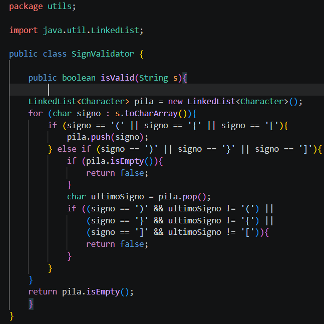
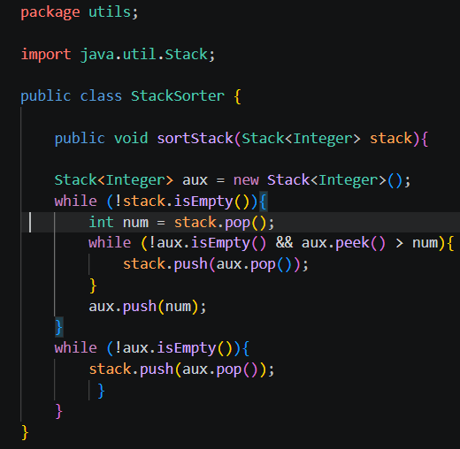
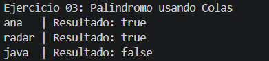
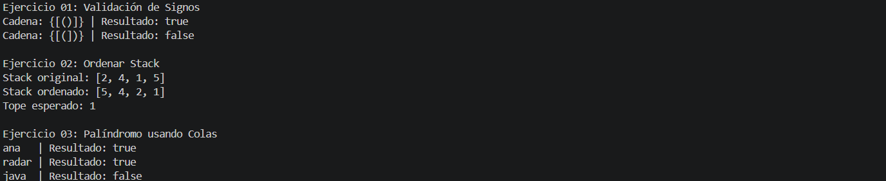

## Ejercicios de logica con estructuras lineales: pilas y colas

- **Nombres**: Edwin Pintado , Kevin Sacaquirin , Galo Prieto.

- **Fecha de entrega**: 13 de junio del 2026
## Descripcion del proyecto.

Desarrollo de tres ejercicios enfocados en el uso de estructuras lineales como pilas(Stack) y colas(Queue) , con el objetio de resolver problemas de razonamiento como los siguientes: 

## Ejercicio01: Validacion de signos.

el primero es crear un algoritmo que detecte si un string contiene () [] {} correctamente ya sea balanceados y cerrados , este algoritmo permite verificar si los simbolos son de apertura o de cierre y devuelve un boleean true si todo esta correcto y false si alguno no esta cerrado.

## Ejercicio02: Ordenar un Stack.

Es un metodo que sirve para ordenar un stack de enteros haciendo que el dato mas pequeño quede en el tope para esto se usa un stack auxiliar para guardar los datos mientras los ordenas.

## Ejercicio03: Determinar si una palabra es palindroma usando colas.

Este algoritmo se utiliza para verificar si una palabra es un palíndroma, es decir, si se lee igual de izquierda a derecha y de derecha a izquierda. Como resultado, devuelve un valor booleano (true o false) y finalmente para esta verificación, utiliza colas internamente.

## Captura o bloque de codigo de cada ejercicio.

## Ejercicio 01:

## Ejercicio 02:

## Ejercicio 03:

## Captura o bloque de consola de cada ejercicio: 

## Ejercicio 01:

## Ejercicio 02:

## Ejercicio 03: 

## URL del Release 2.0.2. :

## RESULTADOS OBTENIDOS: 

Tabla de evidencias requeridas

| Ejercicio | Evidencia de código | Evidencia de consola | Observación |
| :--- | :--- | :--- | :--- |
| Ejercicio 01: Validación de signos ||| |
| Ejercicio 02: Ordenar Stack ||| |
| Ejercicio 03: Palíndromo usando Colas ||| |

## Salida esperada de referencia 

## CONCLUSIONES :

* **Conclusión 1:** 
* **Conclusión 2:** 
* **Conclusión 3:** Al trabajar con el método Queue(Cola) me permitió verificar palíndromos, es decir, las palabras que fueron implementadas, comparando los elementos en su estructura original frente a una inversión. Además esta experiencia me ayudó a comprender, que al momento de programar, primero se debe saber como funciona el método. 